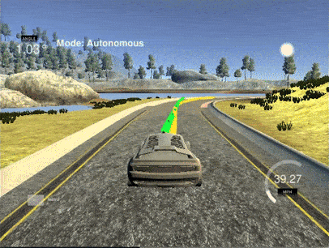

# Drive Safely with MPC Control




## The Model

#### The car model is defined by 6 state variables
* `x`, `y` and `psi` specify the position of the car, where `psi` is the angle between x-axis and the orientation of the car. Note that the x-axis is defined by the initial heading of every timestep of the car.
* `v` is the tangential velocity of the car.
* `cte` means cross track error, the bias between the car and the reference polynomial fitted on the road curve.
* `epsi` means the orientation error, the bias between the car's heading and the reference heading.


#### Actuations
Like the real car, actuations are throttle and steering angle.
Throttle is in range [-1, 1], and -1 means full brake. In the code, they are called:
* steering: `delta`
* throttle: `a`

## Control Optimization

#### The Planing Track
To find the optimized actuations, we first obtain a planing track for a specified timestep by predicting `N` states from the current position. And we use `dt` to control the smoothness of the planing curve. Here we use:
* `N = 11`
* `dt = 0.1`

Therefore the total elapsed time of the planning is 1 second.


#### Cost Function
The optimized actuations are the ones that minimize a cost function including terms that describe the error of the planning track and the wanted track.

The cost is a weighted sum of multiple squared terms:
* **cross track error**
* **orientation error**
* **difference between speed and the minimum speed**, to avoid stopping.
* **actuations**, to avoid sudden actuations.
* **delta of actuations between timesteps**, to make smooth control.

The weights are shown below:
```
double w_cte   = 1.0;
double w_epsi  = 10.0;
double w_v     = 1.0;
double w_delta = 200.0;
double w_a     = 1.0;
double w_dd    = 20.0;
double w_da    = 40.0;
```

## Some Details

#### Fit a Polynomial to Waypoints
The reference track is obtained by fitting polynomial to waypoints of the track. The implementation can be found in   [./utils.cpp](./utils.cpp).  

In this project, a 3rd order polynomial is applied.

#### Global to Local
To make the constraints of the planning track looks more friendly, waypoints are transformed into the car's coordinates before they're used to fit a poly.
Check [./utils.cpp](./utils.cpp).

#### Latency

To consider the Latency of the actuations, just predict the movement of the car in the latency.
```
double x_init    = v * 0.1 / 3600; // latency of 100ms
double epsi_init = -atan(coeffs[1]);
double cte_init  = x_init*sin(epsi_init);
```  
To initialize the state, it should be:
```
state << x_init, 0, 0, v, cte_init, epsi_init;
```

---

## Dependencies

* cmake >= 3.5
 * All OSes: [click here for installation instructions](https://cmake.org/install/)
* make >= 4.1
  * Linux: make is installed by default on most Linux distros
  * Mac: [install Xcode command line tools to get make](https://developer.apple.com/xcode/features/)
  * Windows: [Click here for installation instructions](http://gnuwin32.sourceforge.net/packages/make.htm)
* gcc/g++ >= 5.4
  * Linux: gcc / g++ is installed by default on most Linux distros
  * Mac: same deal as make - [install Xcode command line tools]((https://developer.apple.com/xcode/features/)
  * Windows: recommend using [MinGW](http://www.mingw.org/)
* [uWebSockets](https://github.com/uWebSockets/uWebSockets)
  * Run either `install-mac.sh` or `install-ubuntu.sh`.
  * If you install from source, checkout to commit `e94b6e1`, i.e.
    ```
    git clone https://github.com/uWebSockets/uWebSockets
    cd uWebSockets
    git checkout e94b6e1
    ```
    Some function signatures have changed in v0.14.x. See [this PR](https://github.com/udacity/CarND-MPC-Project/pull/3) for more details.
* Fortran Compiler
  * Mac: `brew install gcc` (might not be required)
  * Linux: `sudo apt-get install gfortran`. Additionall you have also have to install gcc and g++, `sudo apt-get install gcc g++`. Look in [this Dockerfile](https://github.com/udacity/CarND-MPC-Quizzes/blob/master/Dockerfile) for more info.
* [Ipopt](https://projects.coin-or.org/Ipopt)
  * Mac: `brew install ipopt`
       +  Some Mac users have experienced the following error:
       ```
       Listening to port 4567
       Connected!!!
       mpc(4561,0x7ffff1eed3c0) malloc: *** error for object 0x7f911e007600: incorrect checksum for freed object
       - object was probably modified after being freed.
       *** set a breakpoint in malloc_error_break to debug
       ```
       This error has been resolved by updrading ipopt with
       ```brew upgrade ipopt --with-openblas```
       per this [forum post](https://discussions.udacity.com/t/incorrect-checksum-for-freed-object/313433/19).
  * Linux
    * You will need a version of Ipopt 3.12.1 or higher. The version available through `apt-get` is 3.11.x. If you can get that version to work great but if not there's a script `install_ipopt.sh` that will install Ipopt. You just need to download the source from the Ipopt [releases page](https://www.coin-or.org/download/source/Ipopt/) or the [Github releases](https://github.com/coin-or/Ipopt/releases) page.
    * Then call `install_ipopt.sh` with the source directory as the first argument, ex: `sudo bash install_ipopt.sh Ipopt-3.12.1`.
  * Windows: TODO. If you can use the Linux subsystem and follow the Linux instructions.
* [CppAD](https://www.coin-or.org/CppAD/)
  * Mac: `brew install cppad`
  * Linux `sudo apt-get install cppad` or equivalent.
  * Windows: TODO. If you can use the Linux subsystem and follow the Linux instructions.
* [Eigen](http://eigen.tuxfamily.org/index.php?title=Main_Page). This is already part of the repo so you shouldn't have to worry about it.
* Simulator. You can download these from the [releases tab](https://github.com/udacity/self-driving-car-sim/releases).
* Not a dependency but read the [DATA.md](./DATA.md) for a description of the data sent back from the simulator.


## Basic Build Instructions


1. Clone this repo.
2. Make a build directory: `mkdir build && cd build`
3. Compile: `cmake .. && make`
4. Run it: `./mpc`.
