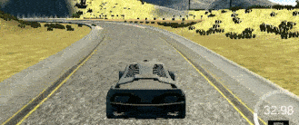
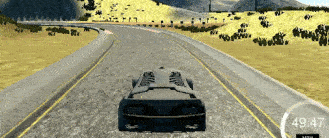

### Drive Safely with PID

I tried three different control plan so there were three types of driving manner.

##### Control Steering Only   
Result:  



Parameters:
```
Kp: 0.25, Ki: 0.0003, Kd: 2.8
```
As shown, the car barely accelerated but drove itself quite smoothly.

###### How the parameters are tuned?
By intuition.   
Before I tried to write some twiddle code, I decided to do it manually and I was lucky enough to find a just OK combination quite quickly. Then I started fine-tuning:

* When the car was lazy to recover from error,  increased `Kp`.

* When the car oscillated about the middle of the track, increase `Kd`.

* The physics of the simulator is quite ideal, so I keep `Ki` small.


##### Control Both Steering and Throttle

###### 1. D controller
In order to have the car drive faster, I add a  **D controller** with `Kd = 100` to tell the car how to accelerate ( throttle = (0, 1] ) according to the change of error. And the control plan looks like:
```c++
throttle = 1.0 / abs(error);
```
  

The idea is simple, as the error change, it means the error is either increasing or decreasing and the car need to slow down in both situations.

The throttle is stronger when the error stops changing and vice versa.

It turns out the car drove faster but looks a little drunk.


###### 2. PID controller

This is a plan that allows braking:

```c++
pid_throttle.Init(0.1, 0.0001, 20.0);
throttle = 1.0 - abs(error); // error given by controller

```




With this setup, the car will be able to fire the brake when it found itself off. I present this as the final plan in the code.
